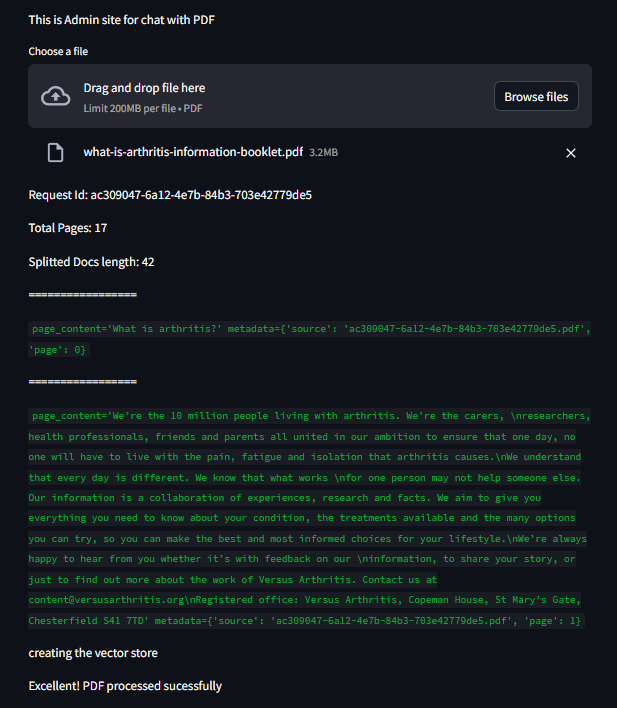
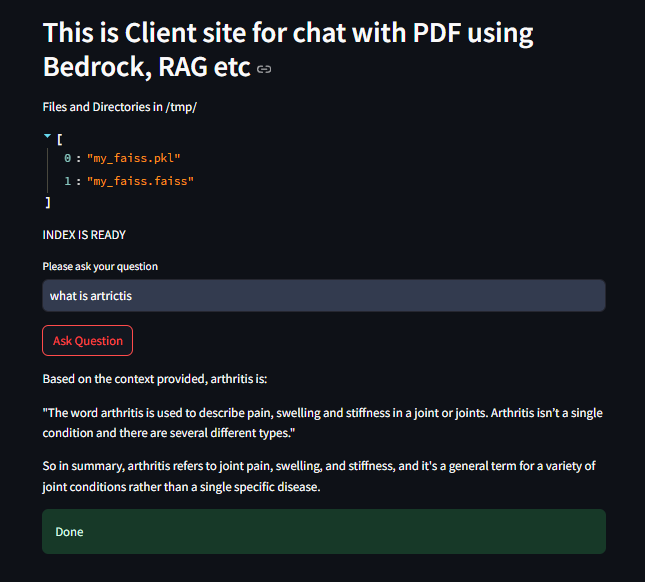
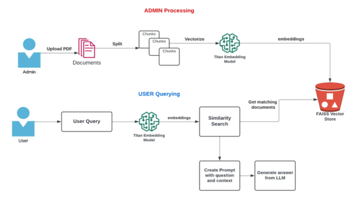

# Two-Part Project: Admin Interface & User Interface

This project consists of two interconnected parts designed to enhance user experience and administrative control.

## Admin Interface
The admin interface is tailored for managing the backend operations of the system. Although it's currently under development, it aims to offer advanced functionalities for user management, role assignments, and system configurations.

## User Interface
The user interface is the frontend component, crafted to provide a seamless and intuitive experience for end-users. Like the admin interface, it's still in progress and plans for deployment are underway.

Both interfaces are being developed concurrently, with the goal of completing and deploying them within the coming weeks.

## Architecture
